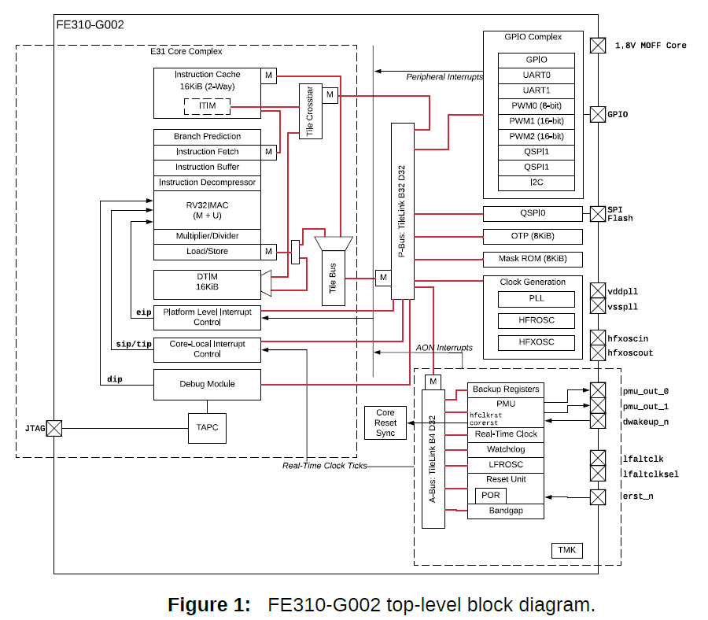

# Universal Asynchronous Receiver/Transmitter (UART)

In this lab, we first take a deeper look at our hardware platform (HiFive1), including its CPU architecture, memory map, external gpio pin map, and other relevant information. Then, you will implement the `ser_read()` function, which reads data from the terminal via UART connection.

# Part 1: Understanding the Hardware Platform


To complete this project, you need to understand a bit more about the hardware. Let’s first open the “SiFive HiFive1 Rev B Getting Started Guide’ (docs/hifive1b-getting-started-guide_v1.1.pdf). This document includes lots of board specific information. 

Go to Section 3.3 “USB to JTAG and Serial Ports” and find Figure 2: J-Link OB connectivity. As you can see in the figure, the platform uses a specialized chip (Segger J-Link OB) to provide two serial connections via USB. For this project, we will only use UART0, which is connected to the main CPU (SiFive FE310-G002 CPU) of the platform. 

To use the UART0, you need to program the CPU. For that, you need to read the datasheet of the CPU (docs/FE310-G002.pdf). Open the CPU datasheet and find Figure 1, shown below (page 11), which shows the top-level block diagram of the CPU. 



The block diagram shows what hardware blocks are integrated in the CPU along with other useful information such as data ram size (16KB DTIM), which is the maximum amount of memory you can use within your program. (This sounds very small, but don’t worry as it is certainly big enough to complete your assignment). Note that there are two UART blocks (UART0 and UART1), of which we will use UART0 for this lab. 

To program the UART0 block, you first need to know where the hardware block is mapped in the CPU’s address space. For this, let’s go to Chapter 4 and find Table 4, shown below. 


This table shows memory mapping information of the hardware blocks of the CPU. As you can see above, the UART0 block is mapped between 0x10013000 - 0x10013FFF (4KB space). 

Next, we need to know how to actually program the UART hardware block, which is described in Chapter 18. Note that each UART block has 8 entry TX and RX FIFO queues to temporarily hold data to be sent and received. The following table (Table 55) shows the control registers that you need to know to interact with a UART hardware block.


The rest of the chapter describes what these control registers are about and how they can be read/written in order to communicate between the UART block hardware and your software code. You will need to refer to this chapter to understand the code we provided and to complete the assignment.   

# Part 2: UART read/write functions

## Task 2.1. Review the EECS388 library 

We already provided the UART initialization and transmit related code as part of the EECS388 library (src/eecs388_lib.[ch]). So, let’s first look at the provided code to better understand how to program the UART block. 

The code below shows the implementation of `ser_setup()`, which initializes the UART block. What it does is simply set the 0th bit of the `txctrl` and `rxctrl` register values as 1. 

```c
void ser_setup()
{
 /* initialize UART0 TX/RX */
 *(volatile uint32_t *)(UART0_CTRL_ADDR + UART_TXCTRL) |= 0x1;
 *(volatile uint32_t *)(UART0_CTRL_ADDR + UART_RXCTRL) |= 0x1;
}
```

If you look at Section 18.6 in the datasheet (docs/FE310-G002.pdf), writing one to bit 0 of the `txctrl` register enables the transmit capability of the UART block. Likewise, in Section 18.7, you can find that receive capability can be enabled by writing one to bit 0 of the `rxctrl` register. Thus, the `ser_setup()` function enables both the transmit and receive capabilities of the UART block. 

```c
void ser_write(char c)
{
 uint32_t regval;
 /* busy-wait if tx FIFO is full  */
 do {
   regval = *(volatile uint32_t *)(UART0_CTRL_ADDR + UART_TXDATA);
 } while (regval & 0x80000000);

 /* write the character */
 *(volatile uint32_t *)(UART0_CTRL_ADDR + UART_TXDATA) = c;
}
```

Now, let’s look at the `ser_write()` function shown above. What this code does is busy-wait while bit 31 of the `txdata` register is 1, which -- according to Section 18.4, Table 56 -- indicates that the transmit FIFO queue is full. If it is not -- i.e., the queue is not full -- then the single character parameter ‘c’ (8 bit) passed into `ser_write()` is written to the [7:0] bits of the `txdata` register. 

## Task 2.2. Implement ser_read()

Reading from the UART block can be performed similarly, but by using the `rxdata` register instead. Consult the datasheet (Section 18.5) and implement the `ser_read()` function in the eecs388_lib.c implementation file. 

Once you correctly implement the `ser_read()` function, you can type ‘r’ or ‘g’ or ‘b’ characters over the serial terminal in your PC to enable red, green, blue LEDs, respectively. 

Note that to open the serial terminal in your PC, click the PlatformIO: Serial Monitor icon, which is the 2nd to last in the toolbar at the bottom left (looks like an electrical plug). 