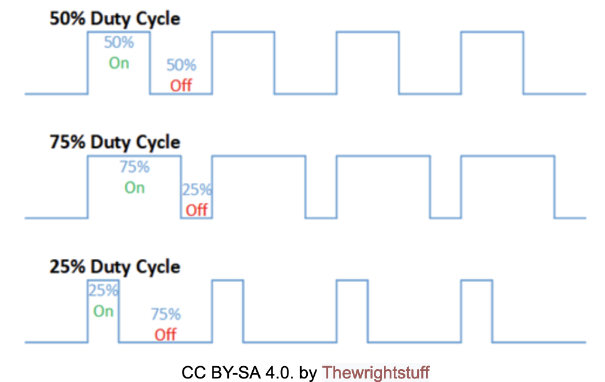
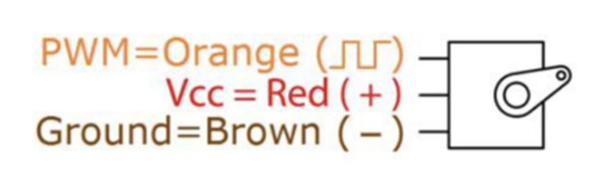
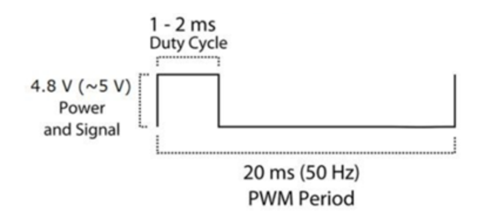

# Servo Motor Control

In this lab, we will control a small servo motor using PWM. In the case of an RC car, a servo motor is typically used to control the steering of the car.  

# Part 1: PWM and servo motor

Pulse-width modulation (PWM) is a way to encode analog signals using digital outputs. While a digital output can be either On (high) or Off (low) at any given time, by altering the durations of the On time (duty cycle) and Off time, we can encode an arbitrary analog signal.

In the diagram below assume the On value is 5V. If the digital output is On for 50% of the duration (top figure), its voltage is rated as 2.5V on average. If the duty cycle is 75%, its voltage is 3.75V on average. If the duty cycle is 25%, its voltage is 1.25V on average.

PWM has a wide variety of applications, one of which is servo motor control. In this lab, we use PWM to control a small servo motor (see docs/sg90_microservo_datasheet.pdf).  

A servo motor receives a PWM signal whose value represents the desired angle of the servo motor. The PWM value ranges may vary depending on the specific servo, but most RC servo motors, including the one we use in this lab, operate between 544 μs (0 degrees) to 2400 μs (180 degree) duty cycle at a 20 ms period (50 Hz).  

This is to say, if we want the servo motor arm at the position for 0 degrees, we need to send to the PWM control line a signal with a 20ms period that is On for 544 μs. 

Connect the servo motor’s Vcc (red, center), ground (brown), and PWM (orange) to the HiFive1 board’s 5V, GND, and PIN 19 (gpio 13) lines, respectively.  

# Part 2: Servo control programming

For this lab, you will need to use two provided library functions: `gpio_write` (ON/OFF) and `delay_usec`. (See the code in src/eecs388_lib.c). Using these functions, you should output the ON signal (5V) for a specific duty cycle duration, followed by the OFF signal until the PWM period elapsed.  

The project code you downloaded already includes the basic skeleton of the program, which will sweep different angles, each of which for about a 1 second duration.  

You will need to fill the `servo` function in the src/eecs388_pwm.c to complete the lab.  

Once you are finished, show your work to the TA.  
