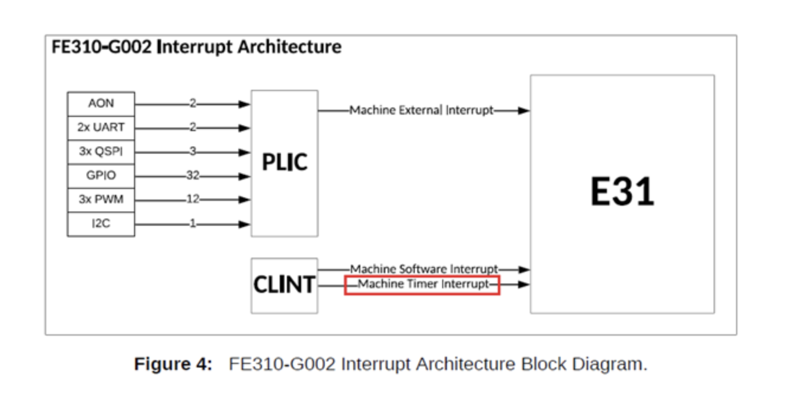
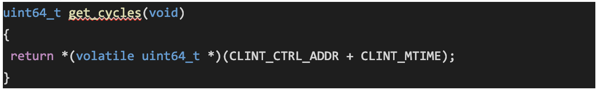
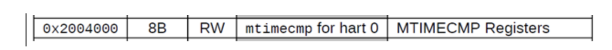
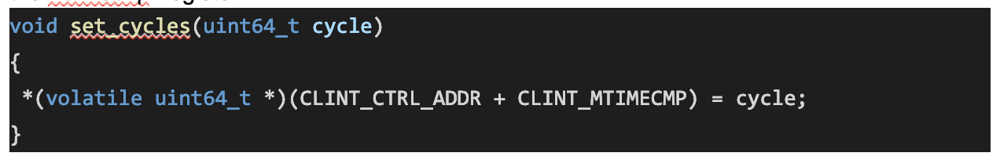
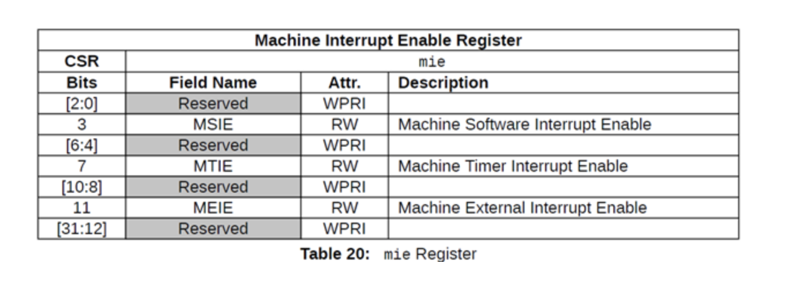
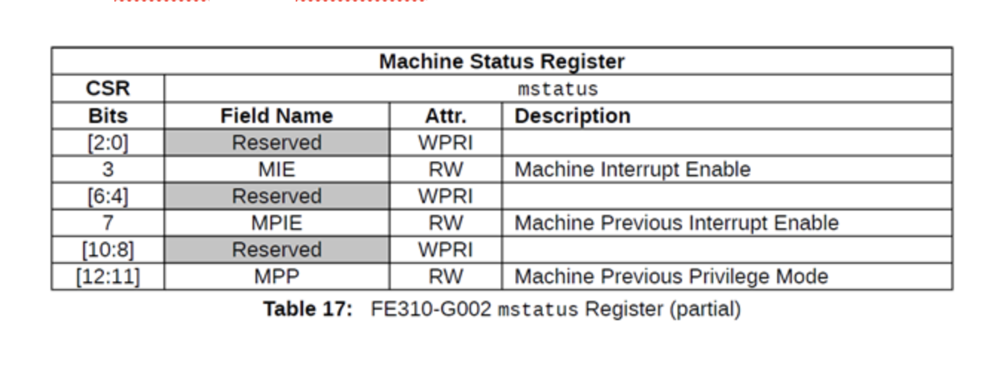
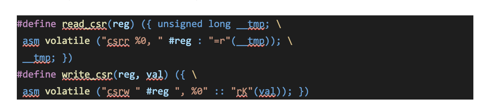
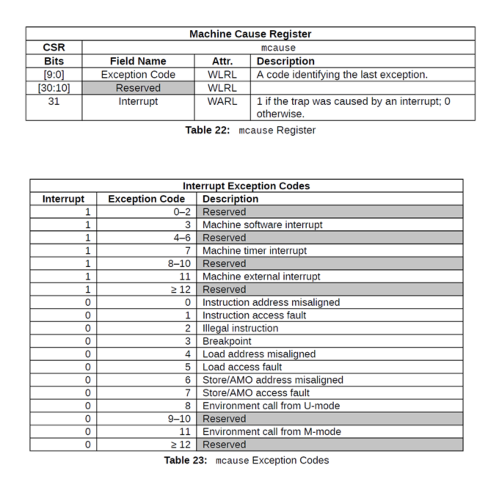

# Timer Interrupt Handling

In this lab, you will write a timer interrupt handler.   

# Part 1: Understanding Timer and Interrupt Handling in RISC-V

To do this lab, you need to understand a bit of background on how interrupts work in RISC-V.  

Open the CPU datasheet (docs/FE310-G002.pdf) and read Chapter 8. Figure 4 shows how various interrupts are connected to the CPU core (E31). What you will use in this lab is ‘Machine Timer Interrupt’ as shown in the figure below.

‘Machine Timer Interrupt’ is a core local timer interrupt, which can be generated by using two architecturally defined timer registers: "`mtime`" and "`mtimecmp`".  

In RISC-V, each core is required to provide a 64 bit real-time counter, which is monotonically increasing at a constant speed and is exposed as a memory mapped register, `mtime`. In the E31 core of the HiFive1 board, CLINT (core local interrupter) hardware block (Chapter 9) is responsible to provide the real-time counter and is mapped at the following address.  

On the HiFive1 platform, the `mtime` register contains the number of cycles counted from the system’s real-time clock, which is running at 32.678kHz (32768Hz).

The following `get_cycles` function, which is provided in eecs388_lib.c, returns the value of the `mtime` register.  

### Test Yourself. How long (in years) will it take to overflow the 64bit timer? Assume the counter begins from zero at reset, and is incremented at the speed of 32678Hz.  

In order to generate a timer interrupt, one should update `mtimecmp` register, which is mapped in the following address on the HiFive 1 platform.  

A timer interrupt (if enabled) is generated whenever `mtime` is greater than or equal to the value in the `mtimecmp` register. Therefore, to generate a timer interrupt after X cycles, one can update `mtimecmp` register as follows: `mtimecmp = mtime + X`

You can use the following `set_cycle` function, which is provided in eecs388_lib.c, to update the `mtimecmp` register.  

Note that the timer interrupt can be enabled or disabled by updating an architecturally defined control register, `mie`, shown below. To enable the timer interrupt, MTIE (bit 7) field of the `mie` register should be set, while it should be cleared to disable it.  

In addition to `mie` register, there is another control register, `mstatus`, which can enable or disable all interrupts. To enable the timer interrupt, both `mie` and `mstatus` registers should be updated as follows: `mie.MTIE = 1` and `mstatus.MIE = 1`.

Note that unlike the timer registers, `mie` and `mstatus` registers are not memory-mapped and can only be accessed by executing special instructions: `csrr` and `csrw` for read and write, respectively. You can use the following macros, which are provided in the eecs388_lib.h.  

For example, `read_csr(mie)` will return the value of the `mie` register, while `write_csr(mie, <32bit value>)` will update the `mie` register.  

Once an interrupt is generated, the CPU traps to the address stored in `mtvec` register. The trap handler is responsible for identifying the cause of the interrupt and jump to the appropriate interrupt service routine. The cause of the interrupt can be read via the `mcause` register, shown below, which is also accessible only via `csrr` or `cswr` instructions (using the macros above, for example, `read_csr(mcause)`). For the timer interrupt, the exception code in the `mcause` register is 7.  

# Part 2: Write your periodic timer interrupt handler

The goal of this lab is to blink an LED at a constant 100ms interval. You need to program the timer handler and interrupt enable/disable functions to complete the lab.  

First, review the main program ‘eecs388_interrupt.c’ and eecs388_lib.[ch]. Currently, `timer_handler`, `enable_interrupt`, `disable_interrupt` are partially filled or empty. Your task is to complete the functions.
