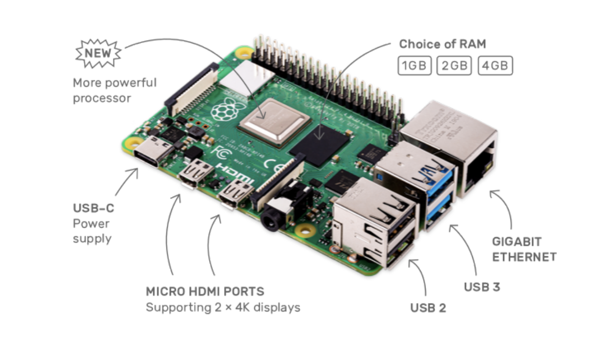
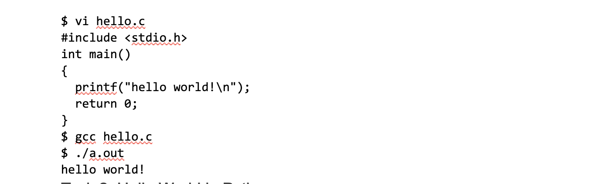
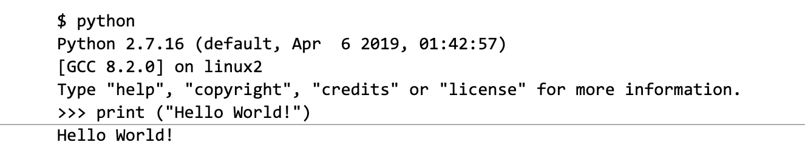
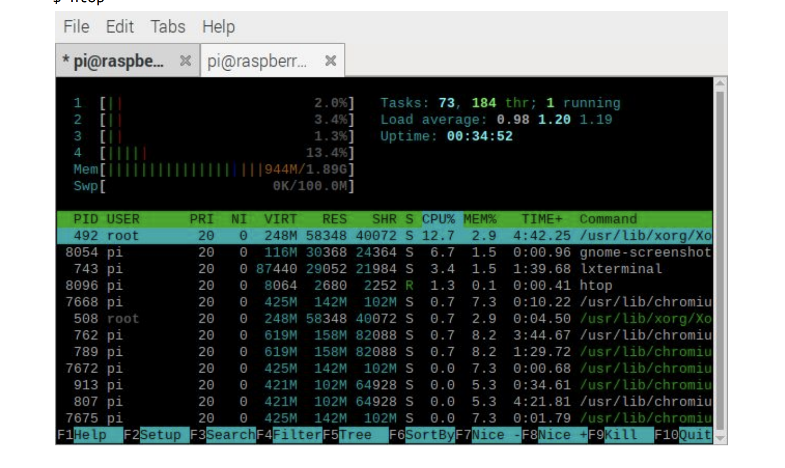
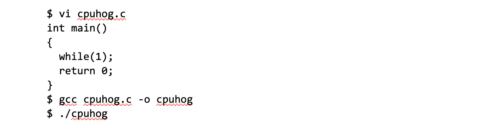
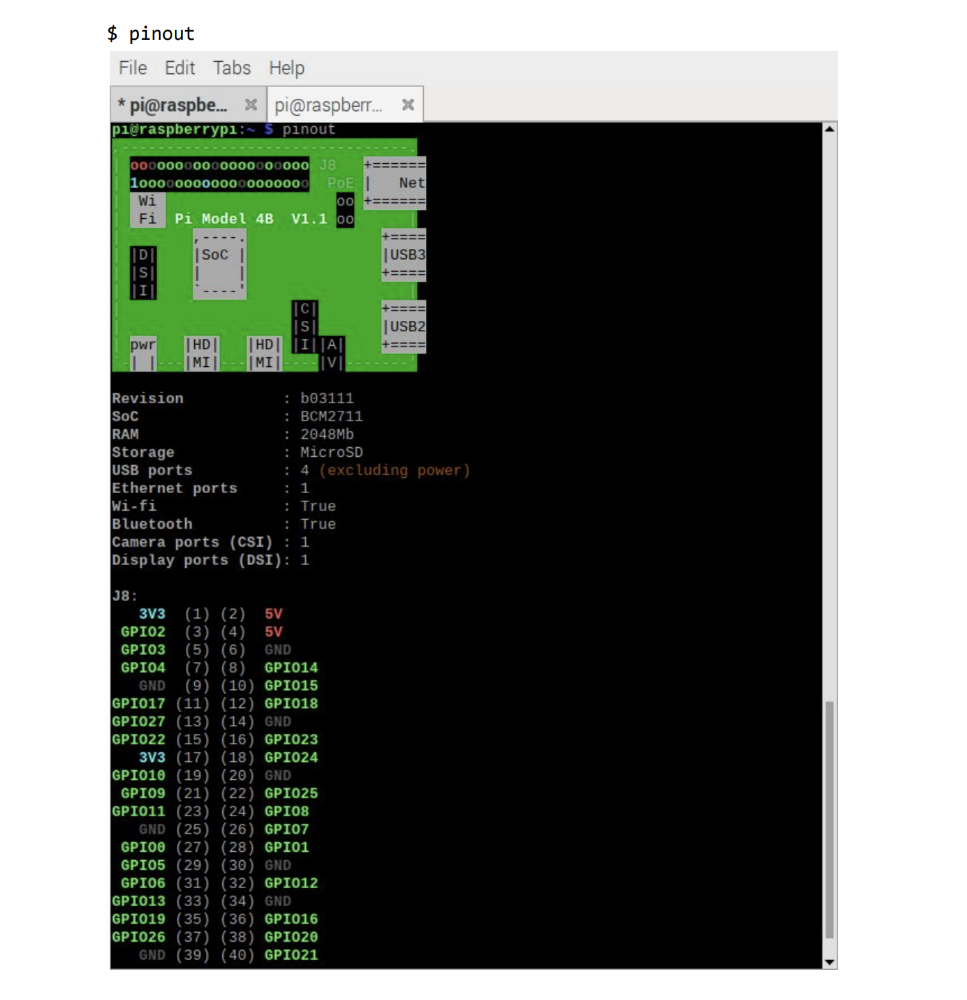
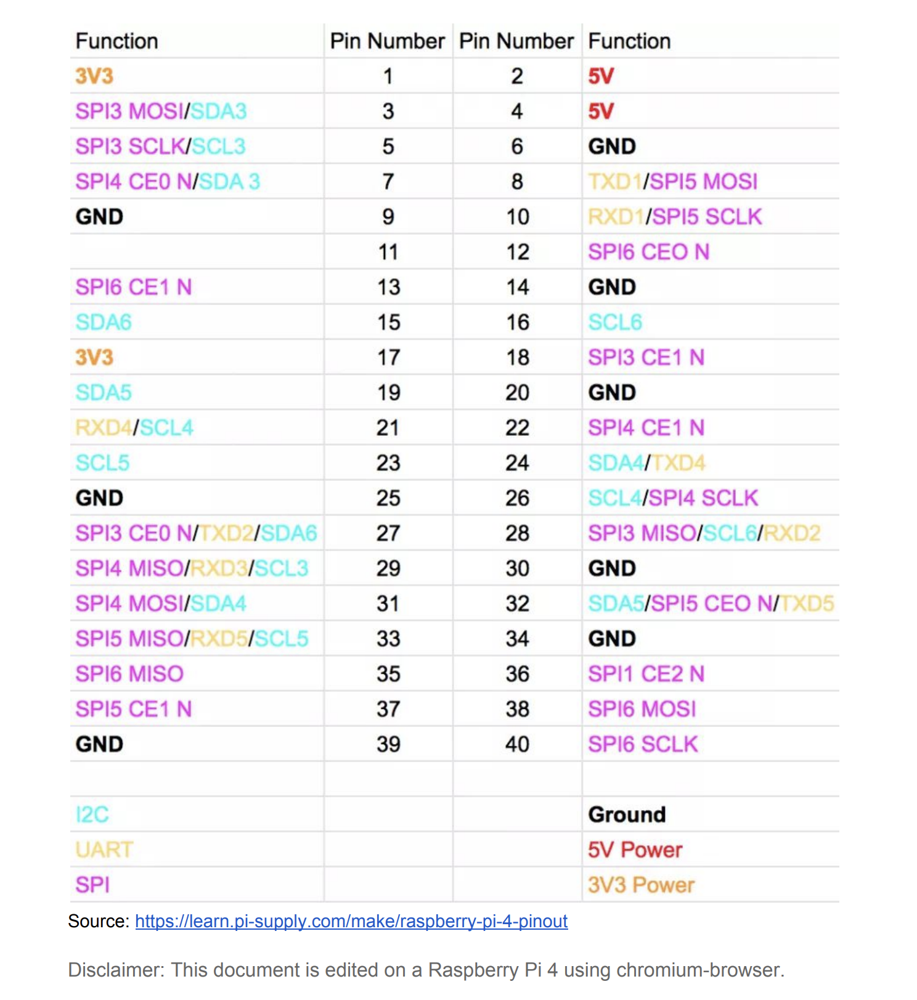

# Intro to Embedded Linux
In this lab you will be introduced to the Raspberry Pi 4, and be familiarized with the system.

Unlike the HiFive1 micro-controller you used, the Raspberry Pi 4 in front of you is essentially a small PC, which runs a general purpose operating system, Linux, complete with a desktop environment. You can basically do anything that you would expect to do on a Linux based PC. On the Raspberry Pi 4, using its computing power, you will later run a deep learning model for vision based real-time control.  

# Part 0: Setup your account in the Raspberry Pi 4.  
Before you do any of such fancy things, you first need to setup your account that you will use for the rest of the semester. In the lab, we have setup the Raspberry Pi's on a switch allowing you to toggle between the EECS machine and the Raspberry Pi.

`The login password should be the same as the login id.` 

Note that, throughout the rest of the semester, you need to use the same Pi 4 because the accounts are local to the specific Pi 4 board.

# Part 1: Getting familiar with the commonly used Linux tools
In this lab, the main goal is to get familiar with the system.  

# Task 1.1 Hello World in C  

Use your favorite editor (vi, emacs, or anything), edit the following hello world in C and python

# Task 2. Hello World in Python

Do the same hello world with python as follows.  

# Task 3. System monitoring

Let’s check what programs are currently running on the pi 4 using htop. Note that Pi 4 has 4 cores and 2 GB of memory. You can visually see what programs are running on which CPU cores and how much they are being used.

`$ htop`

Now, open another terminal and run the following simple C program and see how it is shown in the htop screen.  

There are a couple of very useful Raspberry Pi specific tools. The pinout is such a program. You may need the tool in the future when you connect the Pi 4 to other sensors and the HiFive 1.  

### Appendix
GPIO mapping of Pi 4.

